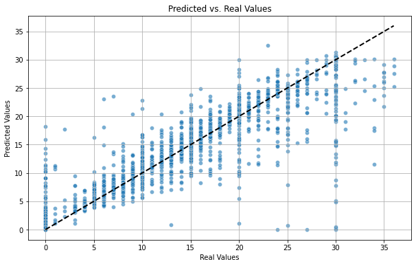
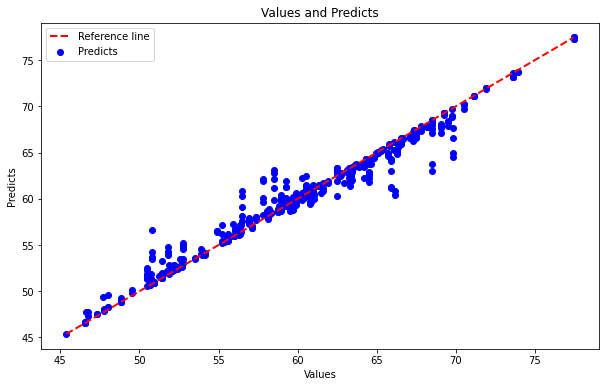
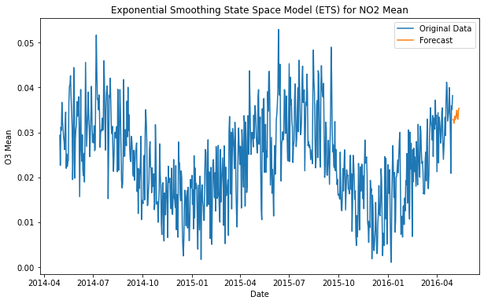
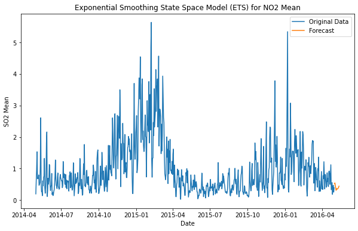
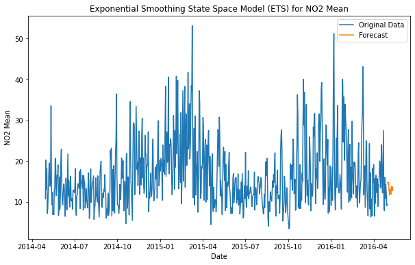
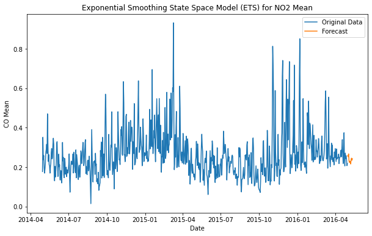
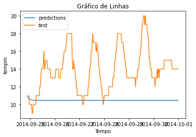
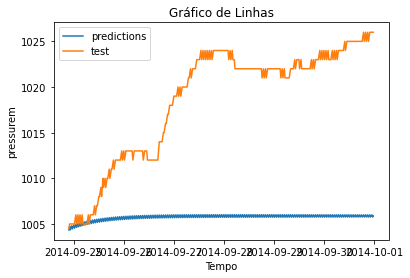
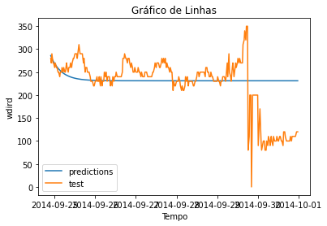

<b>Building smart cities smartly.</b>

  
  

## [Bus delay forecast](https://github.com/makleyston-ufc/ufcity-cloud/tree/main/ufcity-ai-models-samples/toronto-bus-delay-forecast)
**Dataset:** [Toronto Bus Delay 2022](https://www.kaggle.com/datasets/reihanenamdari/toronto-bus-delay-2022)

**Goal:** Identify bus delay based on 'Route', 'Time', 'Date', 'Location', 'Incident', 'Min Gap', 'Direction', 'Vehicle', 'DayOfWeek', and 'IsWeekend'.

**Method used:** Regression based on decision trees.

**Tool used:** Random Forest Regressor.

**Result:**  

- R2 Score: 0.892847963921944

## [Slow traffic forecast](https://github.com/makleyston-ufc/ufcity-cloud/tree/main/ufcity-ai-models-samples/slow-traffic-forecast)
**Dataset:** [Urban traffic density in cities](https://www.kaggle.com/datasets/tanishqdublish/urban-traffic-density-in-cities?resource=download)

**Goal:** Identify slowdowns in the city based on weather conditions, time of day, peak hours, accidents, and traffic density.

**Method used:** Regression based on decision trees.

**Tool used:** Random Forest Regressor.

**Result:**  

- Mean Squared Error: 1.289537341629248
- R2 Score: 0.9688701457764887

## [Pollution trend analysis](https://github.com/makleyston-ufc/ufcity-cloud/tree/main/ufcity-ai-models-samples/pollution-trend-analysis)
**Dataset:** [US Air Pollution](https://www.kaggle.com/datasets/mexwell/us-air-pollution)

**Goal:** Identify trends about air pollution.

**Method used:** Moving average.

**Tool used:** ETS, ARIMA, and SARIMA.

**Result:**  

  
  
  
  

## [Weather forecast](https://github.com/makleyston-ufc/ufcity-cloud/tree/main/ufcity-ai-models-samples/weather-forecast)
**Dataset:** [CityPulse](http://iot.ee.surrey.ac.uk:8080/datasets.html#weather)

**Goal:** Predict series trends based on climate data, such as pressure, humidity, temperature, wind direction, and speed sensors.

**Method used:** Regression based on moving averages to analyze series trends.

**Tool used:** AutoRegressive Integrated Moving Average (ARIMA)

**Result:**  

- hum  ARIMA(5,1,2)(0,0,0)[0]          
- tempm  ARIMA(1,1,3)(0,0,0)[0]          
- wspdm  ARIMA(0,1,2)(0,0,0)[0]          
- wdird  ARIMA(4,1,4)(0,0,0)[0]
- pressurem  ARIMA(4,1,5)(0,0,0)[0]          
- dewptm  ARIMA(2,1,2)(0,0,0)[0]

  
  
  

